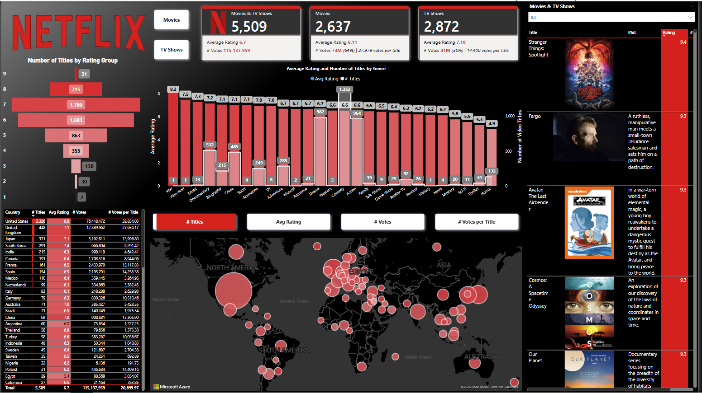

# Netflix Power BI Dashboard

### **Purpose of the Report:**  
This Power BI dashboard provides an analytical view of Netflix’s content library, offering insights into the number of titles, average ratings, user votes, and content distribution across different genres and countries.  

### **Key Insights for Stakeholders:**  

1. **Content Performance Analysis**  
   - Stakeholders can assess the **average rating** of movies and TV shows to understand viewer preferences.  
   - The **top-rated content section** highlights highly rated titles, helping with content acquisition and recommendation strategies.  

2. **Genre-Based Insights**  
   - The bar chart visualizes **average ratings per genre**, allowing decision-makers to identify which genres perform best.  
   - Helps in determining **which genres attract more engagement**, guiding content investment decisions.  

3. **Geographical Distribution**  
   - The world map visualization provides insights into **content distribution by country**, revealing regional content production and audience engagement levels.  
   - Helps Netflix executives make **data-driven decisions on regional licensing, localization, and content expansion**.  

4. **Voting and Engagement Metrics**  
   - The table on the left ranks **countries by number of titles, average ratings, and total votes**, indicating where content is most popular.  
   - The “Votes per Title” metric shows **audience engagement levels**, helping to identify markets with high viewer interaction.  

5. **Filter & Segmentation Capabilities**  
   - Users can **toggle between movies and TV shows** to get focused insights.  
   - Filters allow stakeholders to **analyze trends based on rating, votes, and content type**, enabling targeted decision-making.  

### **Who Can Use This Report?**  
- **Content Strategists** – To determine which genres or types of content should be prioritized for licensing or production.  
- **Marketing Teams** – To identify high-performing content for promotional efforts.  
- **Regional Managers** – To assess demand for content by country and allocate resources accordingly.  
- **Executives & Investors** – To get a high-level overview of Netflix’s content library performance and user engagement.  

## Dashboard

You can see the overal dahsboard above. The dahsboard allows key 
stakeholders to filter the content in many different ways which 
includes filtering by:

1. Movies or TV Shows
2. Country
3. Rating category
3. Genre

This tyoe of filtering allows stakeholders to drill down into very 
specific areas of the data in order to get a better understanding 
of how content is performing overal. An example would be to see 
how the romance genre is performing in France. Drilling down to such 
a granular would allow one ro understand the rating distribution 
of the content among movies or tv shows. 

I used an Azure map visual to allow filtering by just clicking 
on a specific country. The map also gets filtered by the 
selection of other visuals. 

## Data
Data and project idea is from [Power BI Bro](https://github.com/powerbibro/powerbibro). 
I replicated this project step-by-step on my own as a way to learn more 
about the capabilities of Power BI. 